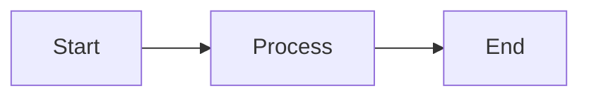

# markd

> Python-based Markdown preview server with live reload, themes, diagrams, and static export capabilities.

[]()
[]()
[]()
[]()

## ✨ Features

- 🔄 **Live Reload**: Automatic browser refresh on file changes with WebSocket
- 🎨 **Multiple Themes**: Light and dark themes with smooth toggle
- 📊 **Mermaid Diagrams**: Render flowcharts, sequence diagrams, and more
- 📐 **MathJax Support**: Beautiful mathematical formulas (KaTeX-ready)
- 📁 **Directory Navigation**: Browse multiple Markdown files with sidebar
- 📤 **Static Export**: Generate self-contained HTML for sharing
- 🔒 **Secure by Default**: Directory traversal prevention, CSP headers
- ⚡ **Fast**: <100ms rendering, <200ms reload latency
- 🌐 **Cross-Platform**: Works on Linux, macOS, and Windows

## 📦 Installation

### From source

```bash
git clone https://github.com/eosho/markd.git
cd markd
pip install -e .
```

## 🚀 Quick Start

### Serve a Single File

The simplest way to preview a Markdown file:

```bash
markd README.md
```

This will:
- Start the server on `http://127.0.0.1:8000`
- Open your default browser automatically
- Enable live reload (changes refresh the browser)

### Serve a Directory

Preview all Markdown files in a directory with navigation:

```bash
markd docs/
```

Features:
- Sidebar navigation with all `.md` files
- Automatic index detection (index.md, README.md)
- Directory browsing support

### Custom Configuration

```bash
markd docs/ --port 3000 --theme dark --no-open
```

## 📖 Detailed Usage

### `serve` Command

Start a Markdown preview server.

```bash
markd serve [PATH] [OPTIONS]
```

#### Arguments

| Argument | Type | Default | Description |
|----------|------|---------|-------------|
| `PATH` | Path | `.` (current directory) | Path to Markdown file or directory to serve |

#### Options

| Option | Short | Type | Default | Description |
|--------|-------|------|---------|-------------|
| `--port` | `-p` | Integer | `8000` | Port to bind server (1024-65535) |
| `--host` | `-h` | String | `127.0.0.1` | Host address to bind server |
| `--theme` | `-t` | Choice | `light` | UI theme: `light` or `dark` |
| `--no-open` | | Flag | `False` | Don't open browser automatically |
| `--no-reload` | | Flag | `False` | Disable live reload (WebSocket) |
| `--log-level` | | Choice | `INFO` | Logging level: `DEBUG`, `INFO`, `WARNING`, `ERROR` |

#### Examples

**Serve with custom port:**
```bash
markd docs/ --port 3000
```

**Dark theme without auto-opening:**
```bash
markd README.md --theme dark --no-open
```

**Debug mode with live reload disabled:**
```bash
markd docs/ --log-level DEBUG --no-reload
```

**Bind to all interfaces (accessible from network):**
```bash
markd docs/ --host 0.0.0.0 --port 8080
```

### `export` Command

Export Markdown to static HTML files.

```bash
markd export SOURCE [OUTPUT] [OPTIONS]
```

#### Arguments

| Argument | Type | Default | Description |
|----------|------|---------|-------------|
| `SOURCE` | Path | **Required** | Source Markdown file or directory |
| `OUTPUT` | Path | `output` | Output directory for exported HTML |

#### Options

| Option | Short | Type | Default | Description |
|--------|-------|------|---------|-------------|
| `--theme` | `-t` | Choice | `light` | Theme for exported HTML: `light` or `dark` |
| `--minify` | | Flag | `False` | Minify exported HTML (reduces file size) |

#### Examples

**Export single file:**
```bash
markd export README.md output/
```

**Export directory with dark theme:**
```bash
markd export docs/ site/ --theme dark
```

**Export with minification:**
```bash
markd export docs/ site/ --minify
```

## 🎨 Themes

markd includes two professionally designed themes:

### Light Theme
- Clean white background
- High contrast for readability
- Suitable for documentation and presentations

### Dark Theme  
- Easy on the eyes in low-light environments
- OLED-friendly dark backgrounds
- Syntax highlighting optimized for dark mode

### Theme Toggle

When using the web interface, you can toggle between themes using the button in the top-right corner:
- **Light mode**: Shows 🌙 moon icon (click to switch to dark)
- **Dark mode**: Shows ☀️ sun icon (click to switch to light)

Your theme preference is saved in browser localStorage.

## 📝 Supported Markdown Features

### GitHub Flavored Markdown (GFM)

- **Tables**: Full table support with alignment
- **Task Lists**: `- [ ]` and `- [x]` checkboxes  
- **Strikethrough**: `~~deleted text~~`
- **Autolinks**: Automatic URL detection

### Code Blocks

Syntax highlighting for 100+ languages using Pygments:

```python
def hello_world():
    print("Hello from markd!")
```

### Mermaid Diagrams



Supported diagram types:
- Flowcharts
- Sequence diagrams
- Class diagrams
- State diagrams
- Gantt charts
- Pie charts

### Mathematical Expressions

Inline math: `$E = mc^2$`

Block math:
```
$$
\int_0^\infty e^{-x^2} dx = \frac{\sqrt{\pi}}{2}
$$
```

### Additional Features

- **Table of Contents**: Auto-generated with permalinks
- **Admonitions**: Note, warning, tip callouts
- **Footnotes**: Reference-style footnotes
- **Emoji**: `:smile:` → 😊


## 🔧 Configuration

### Server Configuration

Configure via command-line options or environment variables:

| Setting | CLI Option | Environment Variable | Default |
|---------|------------|---------------------|---------|  
| Host | `--host` | `MARKD_HOST` | `127.0.0.1` |
| Port | `--port` | `MARKD_PORT` | `8000` |
| Theme | `--theme` | `MARKD_THEME` | `light` |
| Log Level | `--log-level` | `MARKD_LOG_LEVEL` | `INFO` |### Browser Configuration

Themes are stored in browser `localStorage`:
- Key: `markd-theme`
- Values: `light` | `dark`

## 🧪 Development

### Setup Development Environment

```bash
# Clone repository
git clone https://github.com/eosho/markd.git
cd markd

# Create virtual environment
python -m venv .venv
source .venv/bin/activate  # Windows: .venv\Scripts\activate

# Install with dev dependencies
pip install -e ".[dev]"
```

### Run Tests

```bash
# Run all tests
pytest

# Run with coverage
pytest --cov=src/markd --cov-report=html

# Run specific test file
pytest tests/integration/test_http_view.py

# Run with verbose output
pytest -v
```

### Code Quality

```bash
# Format code
black src/ tests/

# Lint code  
ruff check src/ tests/

# Type checking
mypy src/
```

### Project Structure

See `specs/001-python-based-markdown/` for detailed design documents:
- `plan.md` - Overall architecture and tech stack
- `data-model.md` - Entity models and relationships
- `contracts/` - API and CLI contracts
- `tasks.md` - Implementation task breakdown

## 📊 Performance

### Benchmarks

- **Rendering**: <100ms for files up to 100KB
- **Reload Latency**: <200ms from file save to browser refresh
- **Memory Usage**: <150MB for 100 files
- **Cache Hit**: <1ms response time

### Optimization Features

- **Markdown Caching**: Rendered HTML is cached until file changes
- **Static Asset Caching**: 1-year cache headers for CSS/JS
- **Debounced Reloading**: 150ms debounce prevents reload spam
- **Lazy Loading**: Only load visible content in directory mode

## 🐛 Troubleshooting

### Port Already in Use

```bash
# Error: Port 8000 is already in use
markd README.md --port 8080
```

### Live Reload Not Working

1. Check that `--no-reload` is not set
2. Verify WebSocket connection in browser console (F12)
3. Check firewall settings
4. Try `--log-level DEBUG` for detailed logs

### Theme Not Loading

1. Clear browser cache (Ctrl+Shift+R or Cmd+Shift+R)
2. Check browser console for CSS loading errors
3. Verify `src/markd/static/css/themes/` directory exists

### Mermaid Diagrams Not Rendering

1. Ensure CDN is accessible (requires internet connection)
2. Check browser console for JavaScript errors
3. Verify diagram syntax at [mermaid.live](https://mermaid.live)

## 🤝 Contributing

Contributions are welcome! Please read [CONTRIBUTING.md](CONTRIBUTING.md) for guidelines.

### Areas for Contribution

- 📝 **Documentation**: Improve README, add tutorials
- 🧪 **Testing**: Add unit tests (currently 17 missing)
- 🎨 **Themes**: Create new color schemes
- 🌍 **Internationalization**: Add translations
- 🔌 **Plugins**: Extend Markdown functionality

## 📄 License

MIT License - see [LICENSE](LICENSE) file for details.

## 📞 Support

- **Issues**: [GitHub Issues](https://github.com/eosho/markd/issues)
- **Discussions**: [GitHub Discussions](https://github.com/eosho/markd/discussions)
- **Email**: support@markdpy.dev

---

**Made with ❤️ by the markd team**
